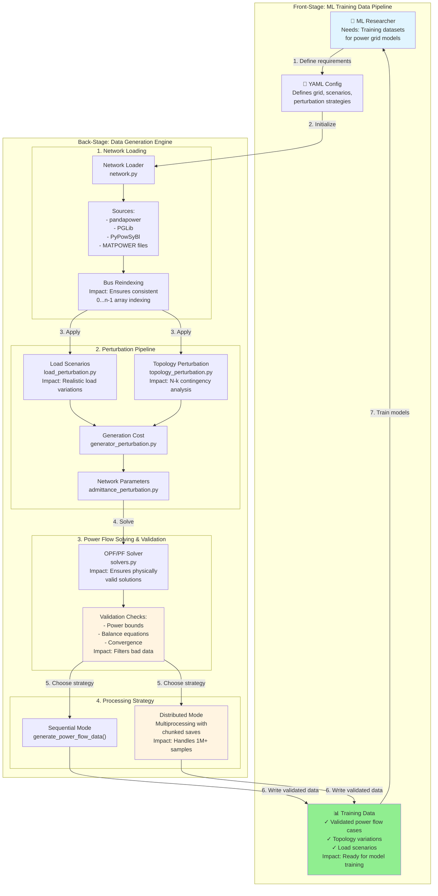

# System Architecture Overview

**Type:** Architecture Diagram
**Last Updated:** 2025-11-10
**Related Files:**
- `gridfm_datakit/generate.py`
- `gridfm_datakit/network.py`
- `gridfm_datakit/process/solvers.py`
- `gridfm_datakit/perturbations/*.py`

## Purpose

Shows ML researchers/data scientists how synthetic power grid training data flows from network loading through perturbations to validated datasets, enabling foundation model training.

## Diagram

## Key Insights

- **ML researcher value**: Single command generates thousands of validated power grid scenarios for training
- **Quality guarantee**: Multi-stage validation ensures physically plausible data (no training on impossible states)
- **Scale enabler**: Distributed processing with chunking handles production-scale datasets (1M+ samples) without memory issues
- **Flexibility**: Plugin architecture (ABC pattern) allows researchers to add custom perturbation strategies
- **Data integrity**: Bus reindexing ensures array operations work correctly across all network types

## Change History

- **2025-11-10:** Initial architecture diagram created
