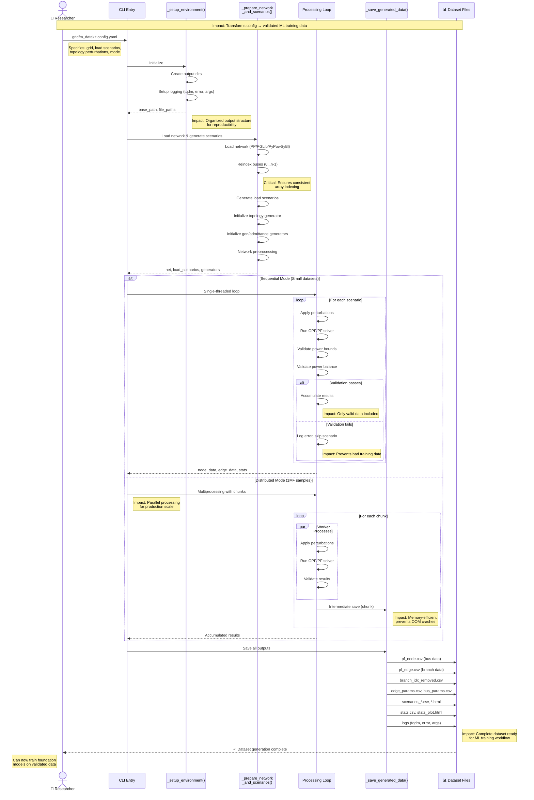

# Data Generation Pipeline Feature

**Type:** Feature Diagram
**Last Updated:** 2025-11-10
**Related Files:**
- `gridfm_datakit/generate.py:generate_power_flow_data()`
- `gridfm_datakit/generate.py:generate_power_flow_data_distributed()`
- `gridfm_datakit/process/process_network.py`

## Purpose

Shows researchers how their config file transforms into training data through the sequential and distributed generation modes, highlighting performance trade-offs.

## Diagram

## Key Insights

- **Mode selection impact**: Sequential for quick iteration (<10K samples), distributed for production (1M+)
- **Memory management**: Chunked saves in distributed mode prevent OOM crashes on large datasets
- **Quality assurance**: Multi-stage validation (convergence, bounds, balance) filters invalid physics
- **Reproducibility**: All logs and parameters saved for experiment tracking
- **Error resilience**: Per-scenario error logging allows partial dataset recovery

## Change History

- **2025-11-10:** Initial feature diagram created
