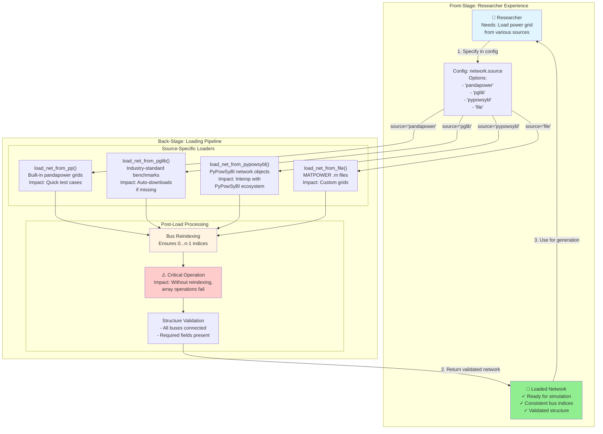

# Network Loading Feature

**Type:** Feature Diagram
**Last Updated:** 2025-11-10
**Related Files:**
- `gridfm_datakit/network.py:load_net_from_pp()`
- `gridfm_datakit/network.py:load_net_from_pglib()`
- `gridfm_datakit/network.py:load_net_from_pypowsybl()`
- `gridfm_datakit/network.py:load_net_from_file()`

## Purpose

Shows researchers how to load grids from multiple sources, with automatic bus reindexing ensuring consistent array operations across all network types.

## Diagram

## Key Insights

- **Source flexibility**: Researchers can use grids from multiple ecosystems without conversion
- **Auto-download**: PGLib grids fetched automatically (removes manual file management)
- **Reindexing criticality**: Ensures numpy array indexing works correctly (missing this causes hard-to-debug errors)
- **MATPOWER compatibility**: Legacy .m files supported for custom/proprietary grids
- **PyPowSyBl interop**: Can use networks from PyPowSyBl pipeline directly

## Change History

- **2025-11-10:** Initial network loading diagram created
