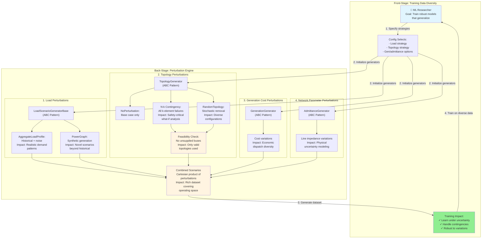

# Perturbation Strategies Feature

**Type:** Feature Diagram
**Last Updated:** 2025-11-10
**Related Files:**
- `gridfm_datakit/perturbations/load_perturbation.py`
- `gridfm_datakit/perturbations/topology_perturbation.py`
- `gridfm_datakit/perturbations/generator_perturbation.py`
- `gridfm_datakit/perturbations/admittance_perturbation.py`

## Purpose

Shows researchers how different perturbation strategies create dataset diversity for training robust foundation models that generalize across operating conditions.

## Diagram

## Key Insights

- **ABC extensibility**: Researchers can implement custom generators without modifying core code
- **N-k contingency value**: Enables safety analysis for grid operators (what if k components fail?)
- **Feasibility filtering**: Prevents training on physically impossible states (buses must have supply)
- **Combinatorial explosion**: N-k with k>1 generates many topologies (use cautiously for large grids)
- **Dataset richness**: Combining strategies creates comprehensive coverage of operating conditions

## Change History

- **2025-11-10:** Initial perturbation strategies diagram created
