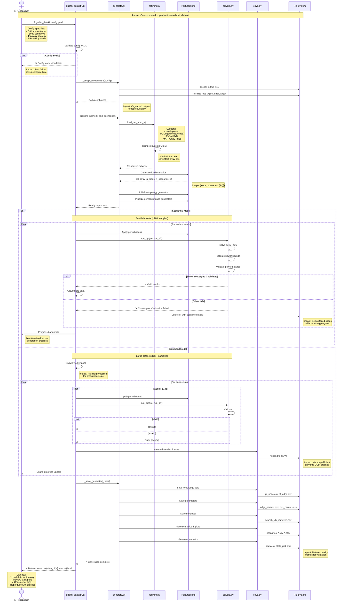

# CLI to Dataset User Journey

**Type:** Sequence Diagram
**Last Updated:** 2025-11-10
**Related Files:**
- `gridfm_datakit/cli.py`
- `gridfm_datakit/generate.py`
- `gridfm_datakit/save.py`

## Purpose

Shows the complete user experience from running CLI command to having validated training data, including error handling and progress feedback.

## Diagram

## Key Insights

- **Fast validation**: Config errors caught before expensive computation starts
- **Progress visibility**: Real-time progress bars reduce user anxiety during long runs
- **Error resilience**: Per-scenario error logging allows partial dataset recovery
- **Auto-download**: PGLib networks fetched automatically (user doesn't need to manage files)
- **Reproducibility**: args.log captures exact configuration for experiment tracking
- **Memory safety**: Chunked distributed mode prevents OOM on million+ sample datasets
- **Quality metrics**: Auto-generated stats help researchers validate dataset before training

## Change History

- **2025-11-10:** Initial user journey diagram created
